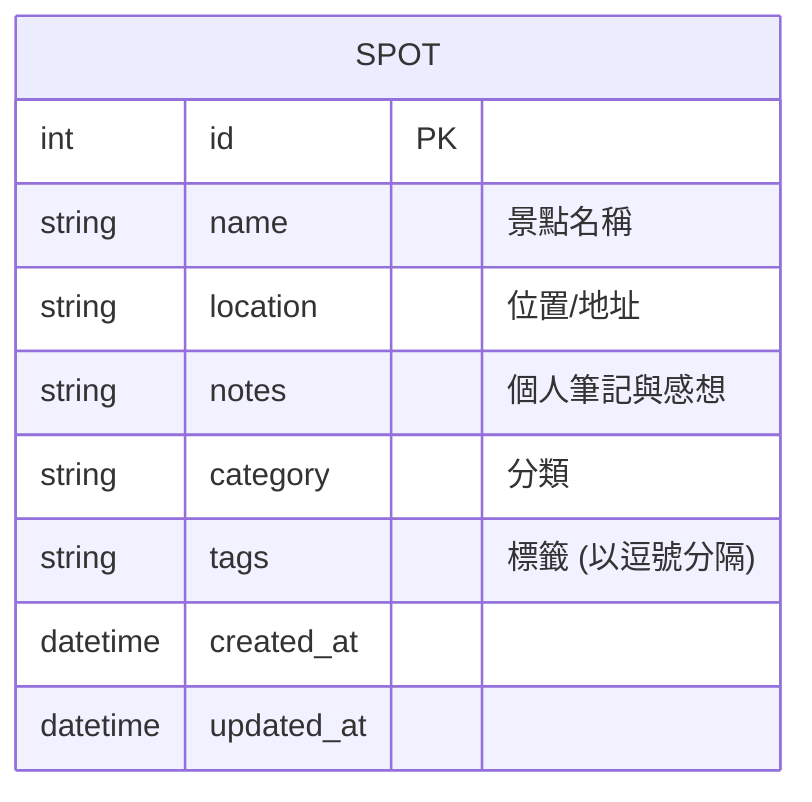

# 資料庫設計 (Database Design)

本文件依據系統架構與功能需求，定義 SQLite 的資料表結構與關聯，並提供對應的建表語法與 Python Model 設計。

## 1. ER 圖（實體關係圖）

為保持 MVP 階段輕量與快速開發，目前設計單一主要實體 `SPOT`。分類與標籤以文字（如逗號分隔的字串）儲存。若未來需支援複雜的標籤過濾，可進一步擴充出獨立的 Tag 資料表並建立多對多關聯。

## 2. 資料表詳細說明

### `spots` (景點表)
儲存景點的基本資訊與使用者的個人筆記。

| 欄位名稱 | 型別 | 必填 | 說明 |
| :--- | :--- | :--- | :--- |
| `id` | INTEGER | 是 | Primary Key, 自動遞增的唯一識別碼 |
| `name` | TEXT | 是 | 景點名稱 |
| `location` | TEXT | 否 | 景點位置或地址 |
| `notes` | TEXT | 否 | 使用者留下的筆記或心得 |
| `category` | TEXT | 否 | 單一分類（如：咖啡廳、展覽） |
| `tags` | TEXT | 否 | 多個標籤，使用逗號分隔的字串儲存（如：安靜,有插座） |
| `created_at` | DATETIME | 是 | 建立時間，預設為當下時間 |
| `updated_at` | DATETIME | 是 | 最後更新時間，預設為當下時間 |

## 3. SQL 建表語法

對應的 SQL 建表語法已儲存於 `database/schema.sql` 檔案中。

## 4. Python Model 程式碼

對應的 CRUD 模型程式碼已建立於 `app/models/spot.py` 檔案中，採用原生 `sqlite3` 實作。
