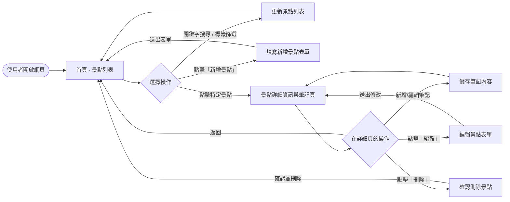
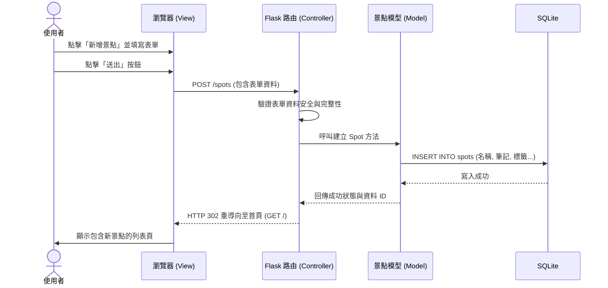

# 系統流程圖與使用者流程 (Flowchart)

本文件依據 PRD 與系統架構文件，視覺化使用者的操作路徑（User Flow）以及系統內部的資料流動（System Flow），確保後續實作階段能夠清楚掌握各個頁面與功能的串接。

## 1. 使用者流程圖（User Flow）

此流程圖描述使用者從進入首頁開始，能夠進行的各項主要操作路徑。

## 2. 系統序列圖（Sequence Diagram）

此序列圖以「**使用者新增景點**」為例，展示 MVC 架構中 View (瀏覽器)、Controller (Flask 路由)、Model 與 SQLite 資料庫之間的完整互動流程。

## 3. 功能清單對照表

將上述操作路徑轉換為 Flask 中具體的路由設計，定義對應的 URL 路徑與 HTTP 請求方法。

| 功能 | 說明 | HTTP 方法 | URL 路徑 |
| :--- | :--- | :--- | :--- |
| **首頁：景點列表與搜尋** | 顯示所有景點，並可依賴 Query String 進行關鍵字搜尋或標籤篩選。 | GET | `/` 或 `/spots` |
| **新增景點表單** | 顯示用於填寫新景點資訊的網頁表單。 | GET | `/spots/new` |
| **儲存新景點** | 接收表單資料，寫入資料庫並重新導向至首頁。 | POST | `/spots` |
| **景點詳細資訊與筆記** | 檢視單一景點的詳細資料與已撰寫的個人筆記。 | GET | `/spots/<id>` |
| **編輯景點表單** | 顯示包含既有資料的表單，供使用者修改景點內容或筆記。 | GET | `/spots/<id>/edit` |
| **更新景點資訊** | 接收修改後的資料並更新資料庫，完成後導向至詳細頁面。 | POST | `/spots/<id>/edit` |
| **刪除景點** | 刪除指定的景點，並重新導向至首頁。 | POST | `/spots/<id>/delete` |
